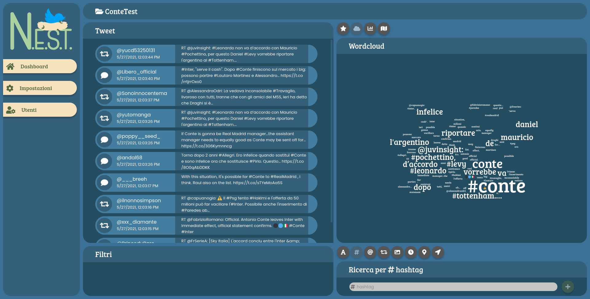
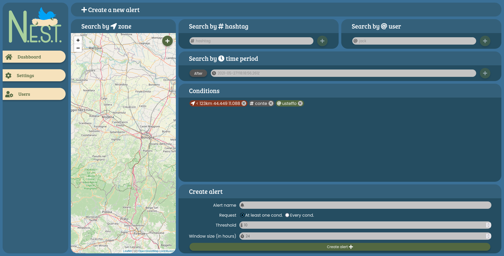

Il progetto
===========

**N.E.S.T.** (Noi Estraiamo Statistiche Tweet) è un progetto realizzato nel 2021 per
l'**esame di Progetto del Software** del corso di Informatica all'Unimore.

Suddivisione in moduli
----------------------

Il progetto è composto da tre parti:

:py:mod:`nest_crawler`
    Un modulo scritto in `Python`_ usando :py:mod:`tweepy` che recupera tweet attraverso la `Twitter API`_ secondo le
    condizioni presenti all'interno del database e li salva per future elaborazioni.

:py:mod:`nest_backend`
    Un web server scritto in `Python`_ usando il framework :py:mod:`flask` che fornisce un'API HTTP per visualizzare e
    manipolare i dati dell'applicazione, gestendo autenticazione, autorizzazione e comunicazione con il database.

:js:mod:`nest_frontend`
    Una applicazione web scritta in `JSX`_ usando il framework :js:mod:`react` che comunica con il backend, mostrando
    all'utente i dati del backend in una formato immediatamente comprensibile.

.. _Python: https://www.python.org/
.. _Twitter API: https://developer.twitter.com/en/docs/twitter-api
.. _JSX: https://reactjs.org/docs/introducing-jsx.html

Screenshots
-----------

.. image:: frontendDashboard.png

.. image:: frontendRepositoryCreate.png

.. image:: frontendRepositoryShare.png

