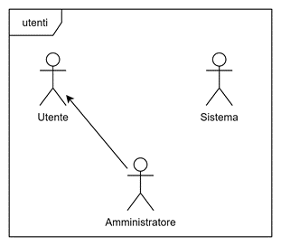
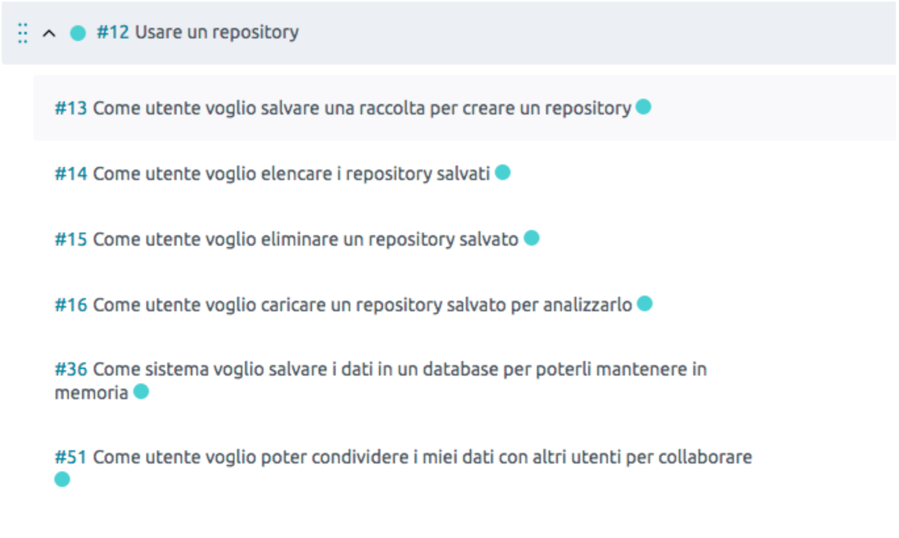

Introduzione
============

.. todo::
    Lasciamo il tempo al futuro?

Obiettivo
---------

L'obiettivo del progetto è la creazione di un software per fornire l'aggregazione e l'analisi di `Tweet`_, in modo da
rilevare eventi *macroscopici*, *locali* o più semplicemente filtrarli in base a delle *keyword*.

Il prodotto sarà utilizzato dal cliente e da un piccolo gruppo di suoi dipendenti per effettuare ricerche statistiche.

Il software andrà ad integrarsi direttamente con `Twitter`_, da cui verranno raccolti dati e su cui verranno pubblicate
allerte su di essi.

.. _Tweet: https://help.twitter.com/it/using-twitter#tweets
.. _Twitter: https://twitter.com/

Campo di applicazione
---------------------

Il software trova utilizzo principalmente in **ambito statistico**, essendo il suo scopo quello di raccogliere dati e
permettere di analizzarli tramite un'interfaccia grafica.

Caratteristiche degli utenti
----------------------------

Il software potrà essere utilizzato da utenti con una discreta esperienza nell'analisi di dati ma senza particolari
conoscenze informatiche.

Glossario
---------

Repository
    Raccolta di tweet che soddisfano determinate condizioni.

Condizione
    Predicato logico che deve essere soddisfatto da un tweet per essere raccolto in fase di raccolta dati, o per essere
    contato in fase di allertamento utente.

Filtro
    Predicato logico che deve essere soddisfatto da un tweet per essere visualizzato in fase di analisi dati.

Allarme
    Notifica inviata all'utente attraverso un mezzo telematico, come email oppure un tweet.

Utente
    Utilizzatore del software con un proprio account creato dall'amministratore della piattaforma.

    In particolare, la piattaforma prevederà due tipologie di utenti:

    Utente regolare
        Potranno eseguire attività di creazione, analisi, condivisione, archiviazione ed eliminazione dei propri repository.

    Utente amministratore
        Potrà effettuare tutte le attività dell'utente regolare, e in aggiunta potrà creare ed eliminare nuovi utenti
        regolari.

.. todo::
    Estendere il glossario qualora vengano incontrati altri termini.

Macro-funzionalità
------------------

Il software permetterà di selezionare **condizioni** con cui scegliere quali tweet raccogliere:

- in base ai loro `hashtag`_
- in base al loro autore
- in base alla loro `posizione geografica`_ (ove presente)
- in base alla loro data di pubblicazione

Selezionate le condizioni, l'utente potrà creare una **repository**: una cartella in cui verranno raccolti i tweet
soddisfacenti le condizioni richieste.

Una volta raccolti, i tweet di una repository potranno essere **analizzati** in qualsiasi momento: durante l'analisi,
saranno mostrate statistiche e grafici relativi ai tweet.

La raccolta potrà essere interrotta in qualsiasi momento **archiviando** il repository.

Sarà possibile **condividere** una repository con altri utenti della piattaforma, permettendo loro di analizzarla.

Infine, l'utente potrà configurare una repository in modo che gli invii una **allerta** qualora vengano raccolti un dato
numero di tweet in una certa *finestra temporale*.

.. _hashtag: https://help.twitter.com/it/using-twitter/how-to-use-hashtags
.. _posizione geografica: https://help.twitter.com/en/safety-and-security/tweet-location-settings

1.6 Database
^^^^^^^^^^^^
1.6.1 Definizioni, glossario
""""""""""""""""""""""""""""

    **Alert**
        | Un alert è un allarme impostato da un utente che si "attiva" quando un numero di tweet che rispetta certe condizioni (poste in and oppure or) supera una certa soglia, indicata dall'utente.
        | Ogni volta che l'alert si attiva, viene creata una "notifica", ovvero una entry nella tabella Notifications. Questo permette di tenere conto del numero di volte in cui l'alert viene triggerato. Gli alert sono legati al repository di appartenenza, e quando uno di essi viene allertato viene inviata una mail all'admin e pubblicato un tweet sull'account Twitter usato per le analisi.
        | La tabella alert contiene le seguenti colonne:

    .. list-table::
       :header-rows: 1
       :stub-columns: 1
       :align: left

       * -
         - Definizioni
       * - id (INTEGER, PK)
         - l'identificativo dell'alert
       * - name (VARCHAR, NOT NULL)
         - il nome dell'alert
       * - limit (INTEGER, NOT NULL)
         - il numero di tweet che innescano l'alert
       * - window_size (INTEGER, NOT NULL)
         - numero di ore in cui il limit può venire superato
       * - evaluation_mode (ENUM/SMALLINT, NOT NULL)
         - può essere posto a all_or oppure all_not
       * - repository_id (INTEGER, FK, NOT NULL)
         -

    **Authorization**
        | Una autorizzazione è un'entità che rappresenta il permesso, concesso dal creatore del repository ad un altro utente, di ispezionare il contenuto di un repo e di eseguire analisi su di esso.
        | La tabella authorization contiene le seguenti colonne:

    .. list-table::
       :header-rows: 1
       :stub-columns: 1
       :align: left

       * -
         - Definizioni
       * - rid (INTEGER, PK, FK)
         - id del repository
       * - email (VARCHAR, PK, FK)
         - email dell'utente

    **Composed**
        | Composed è una tabella le cui righe indicano l'appartenenza di un Tweet ad un certo repository.
        | La tabella composed contiene le seguenti colonne:

    .. list-table::
       :header-rows: 1
       :stub-columns: 1
       :align: left

       * -
         - Definizioni
       * - rid (INTEGER, PK, FK)
         - id del repository
       * - snowflake (VARCHAR, PK, FK)
         - id del tweet

   **Condition**
        | Una condizione è un elemento che viene usato da repository e alert per cercare e classificare i tweet.
        | Le condizioni possono essere di diversi tipi:

        - **hashtag** (valore 0);
        - **location** (valore 1, deprecato);
        - **time** (valore 2);
        - **coordinates** (valore 3);
        - **place** (valore 4, riservato per usi futuri);
        - **user** (valore 5);

        La tabella condition contiene le seguenti colonne:

    .. list-table::
       :header-rows: 1
       :stub-columns: 1
       :align: left

       * -
         - Definizioni
       * - id (INTEGER, PK)
         - id della condition
       * - type (ENUM/SMALLINT, NOT NULL)
         - tipo del contenuto
       * - content (VARCHAR, NOT NULL)
         - contenuto della condition
       * - repository_id (INTEGER, FK, NOT NULL)
         -

**Contains**
        Contains è una tabella le cui righe indicano la presenza di una certa condition rispetto ad un certo tweet.
        La tabella contains contiene le seguenti colonne:

    .. list-table::
       :header-rows: 1
       :stub-columns: 1
       :align: left

       * -
         - Definizioni
       * - cid (INTEGER, PK, FK)
         - id della condition
       * - snowflake (VARCHAR, PK, FK)
         - id del tweet

**MadeOf**
        MadeOf è una tabella le cui righe indicano il legame tra un alert e una certa condition.
        La tabella madeof contiene le seguenti colonne:

    .. list-table::
       :header-rows: 1
       :stub-columns: 1
       :align: left

       * -
         - Definizioni
       * - aid (INTEGER, PK, FK)
         - id dell'alert
       * - cid (INTEGER, PK, FK)
         - id della condition

**Notification**
        | Una notification è un'entità che consente di tenere traccia del momento in cui un certo alert si è attivato per l'ultima volta.
        | La tabella notification contiene le seguenti colonne:

    .. list-table::
       :header-rows: 1
       :stub-columns: 1
       :align: left

       * -
         - Definizioni
       * - id (INTEGER, PK)
         - id della notifica
       * - ora (TIMESTAMP, NOT NULL)
         - timestamp di attivazione
       * - alert_id (INTEGER, FK, NOT NULL)
         -

**Repository**
        | Un repository è un "contenitore" di tweet, a cui sono legati alert, autorizzazioni di lettura e condizioni.
        | Le condizioni possono essere messe in and oppure or, inoltre un repository può venire archiviato prima divenire eliminato. Quando un repository non è archiviato, questo viene riempito di tweet su base oraria, cosa che non accade se viene archiviato.
        | La tabella repository contiene le seguenti colonne:

    .. list-table::
       :header-rows: 1
       :stub-columns: 1
       :align: left

       * -
         - Definizioni
       * - id (INTEGER, PK)
         - id del repository
       * - name (VARCHAR, NOT NULL)
         - nome del repository
       * - start (TIMESTAMP)
         - timestamp di partenza del repository
       * - end (TIMESTAMP)
         - timestamp di chiusura del repository
       * - is_active (BOOLEAN, NOT NULL)
         - flag per segnalare se il repo è aperto o meno
       * - evaluation_mode (ENUM/SMALLINT, NOT NULL)
         - può essere posto a all_or oppure all_not
       * - owner_id (VARCHAR, FK, NOT NULL)
         - email del proprietario
       * - is_deleted (BOOLEAN, NOT NULL)
         - flag per segnalare se l'oggetto è eliminato o meno

**Tweet**
    | Un tweet è un'entità che viene raccolta dal componente crawler, e quando viene inserita nella base di dati viene
    | legata ad un repository e alle condition che contiene. Un tweet contiene informazioni relativamente a chi l'ha creato,
    | eventuali immagini, il tempo di creazione, il tempo di inserimento nel db e l'opzionale posizione legata al tweet.
    | La tabella tweet contiene le seguenti colonne:

    .. list-table::
       :header-rows: 1
       :stub-columns: 1
       :align: left

       * -
         - Definizioni
       * - snowflake (VARCHAR, PK)
         - id univoco del tweet
       * - content (VARCHAR)
         - contenuto del tweet
       * - location (VARCHAR)
         - stringa contenente informazioni sulla posizione
       * - place (VARCHAR)
         - riservato per sviluppi futuri
       * - poster (VARCHAR)
         - informazioni sull'utente che ha creato il tweet
       * - insert_time (TIMESTAMP, NOT NULL)
         - timestamp dell'inserimento del tweet
       * - image_url (VARCHAR)
         - link alle immagini, se presenti
       * - post_time (TIMESTAMP)
         - timestamp relativo all'invio del tweet

**User**
    Uno user è l'utilizzatore della piattaforma. E' presente di default un utente admin, il quale può creare nuovi utenti.
    La tabella user contiene le seguenti colonne:

    .. list-table::
       :header-rows: 1
       :stub-columns: 1
       :align: left

       * -
         - Definizioni
       * - email (VARCHAR, PK)
         - email dell'utente
       * - username (VARCHAR, NOT NULL)
         - username dell'utente
       * - password (BYTEARRAY, NOT NULL)
         - sale della password, codificata usando l'algoritmo bcrypt
       * - isAdmin (BOOLEAN, NOT NULL)
         - true se l'utente è admin

Casi d'uso
----------

N.E.S.T. prevede tre tipologie di *agenti* ("utenti" UML): **utente**, **amministratore** e **sistema**.

I principali casi d’uso individuati durante la progettazione di N.E.S.T. sono:

- La gestione degli utenti da parte di un Amministratore:

  .. image:: CasiUso1.PNG

- La gestione del login da parte di un Utente:

  .. image:: CasiUso2.PNG

- La gestione delle Allerte sia dal punto di vista dell’Utente che del Sistema:

  .. image:: CasiUso3.PNG

- La gestione della raccolta da parte dell'utente:

  .. image:: CasiUso4.PNG

- La gestione di un repository da parte dell'utente:

  .. image:: CasiUso5.PNG

- La visualizzazione di un repository:

  .. image:: CasiUso6.PNG

Backlog generale
----------------

Si riporta qui di seguito il Backlog definito ad inizio progetto, prima dell’avvio dello sviluppo.
Gli elementi dal bordo grigio sono le epiche:

.. note::
    Alcune user story sono state rimosse in seguito al feedback ricevuto durante il primo sprint!

.. image:: Backlog3.PNG

.. image:: Backlog5.PNG
