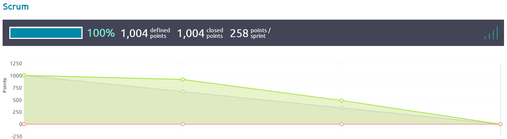

Processo di sviluppo
====================

Ruoli
-----

Per lavorare più efficientemente, si è assegnato uno o più "ruoli" a ogni membro del team in base alle proprie
competenze.

:Stefano Goldoni: Product Owner, Tester
:Flavia Cocca: Scrum Master, UI Designer
:Chiara Calzolari: UI Designer, Translator
:Stefano Pigozzi: Frontend Developer, Sysadmin
:Giovanni Anniballi: Lead Tester
:Giorgio Minoccari: Analyst, Crawler Developer
:Lorenzo Balugani: Database Architect, Backend Developer

Questi ruoli sono stati usati in maniera **flessibile**; è capitato infatti moltissime volte che un membro con un ruolo
ne aiutasse un altro con un ruolo diverso: ad esempio, è successo che i Developer aiutassero i Tester indicando loro
particolarità specifiche dei linguaggi di programmazione utilizzati, oppure che gli UI Designer aiutassero nella
scrittura della documentazione.

Sprint
------

Lo sviluppo si è svolto in **4 Sprint** dalla durata di **2 settimane ciascuno**.

.. toctree::
    :maxdepth: 1

    sprint0/index
    sprint1/index
    sprint2/index
    sprint3/index

Burndown chart complessiva
--------------------------

