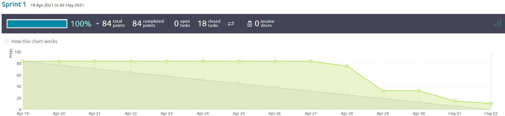
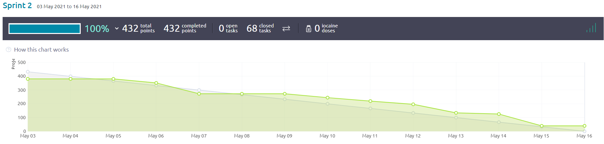
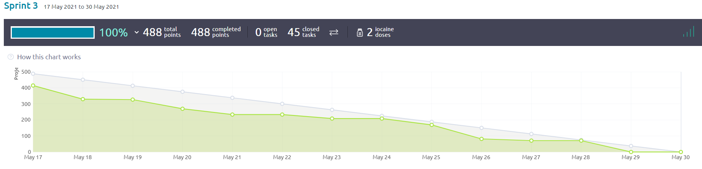

Processo di sviluppo
====================

Lo sviluppo è stato suddiviso in 4 sprint, ciascuno della durata di 2 settimane:

Sprint 0 - dal 5 Aprile al 18 Aprile

`Diari`_ dei partecipanti

.. _Diari: http://localhost:63342/N.E.S.T./Modulo%20unico/docs/build/html/development/sprint0/index.html#registro-attivita

`Retrospettiva`_ dello sprint 0

.. _Retrospettiva: http://localhost:63342/N.E.S.T./Modulo%20unico/docs/build/html/development/sprint0/index.html#retrospettiva-finale

Sprint 1 - dal 19 Aprile al 2 Maggio

Burndown dello sprint 1

`Diari dei partecipanti dello sprint 1`_

.. _Diari dei partecipanti dello sprint 1: http://localhost:63342/N.E.S.T./Modulo%20unico/docs/build/html/development/sprint1/index.html#registro-attivita

`Retrospettiva dello sprint 1`_

.. _Retrospettiva dello sprint 1: http://localhost:63342/N.E.S.T./Modulo%20unico/docs/build/html/development/sprint1/index.html#retrospettiva-finale

Sprint 2 - dal 3 Maggio al 16 Maggio

Burndown dello sprint 2

:width: 400

`Diari dei partecipanti dello sprint 2`_

.. _Diari dei partecipanti dello sprint 2: http://localhost:63342/N.E.S.T./Modulo%20unico/docs/build/html/development/sprint2/index.html#registro-attivita

`Retrospettiva dello sprint 2`_

.. _Retrospettiva dello sprint 2: http://localhost:63342/N.E.S.T./Modulo%20unico/docs/build/html/development/sprint2/index.html#retrospettiva-finale

Sprint 3 - dal 19 Maggio al 30 Maggio

Burndown dello sprint 3

:width: 400

`Diari dei partecipanti dello sprint 3`_

.. _Diari dei partecipanti dello sprint 3: http://localhost:63342/N.E.S.T./Modulo%20unico/docs/build/html/development/sprint3/index.html#registro-attivita

`Retrospettiva dello sprint 3`_

.. _Retrospettiva dello sprint 3: http://localhost:63342/N.E.S.T./Modulo%20unico/docs/build/html/development/sprint3/index.html#retrospettiva-finale

In generale:

Burndown totale

.. image:: Burndown4.png
          :width: 400

.. todo::

    Mi dicono che qui non funzionano alcune robe, mettere a posto
    Also, fixare i link interni