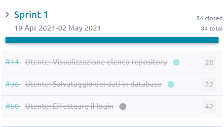
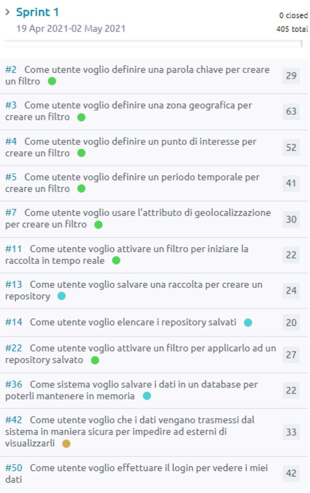
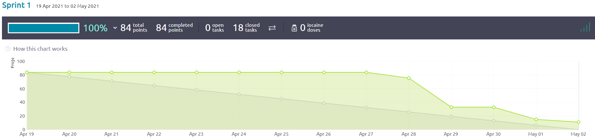

Sprint 1: 19 Apr - 02 Mag
=========================

Consegna
--------

La seguente documentazione è stata fornita dal cliente durante questo sprint:

- :download:`Sprint 1 <1-sprint-requirements.pdf>`

Goal
----

Il **goal** per questo sprint è stato costruire una codebase facilmente mantenibile e modulare, che potesse accomodare grossi
cambiamenti nei sottomoduli senza impattare gli altri:

- Dal punto di vista del **backend**: l'obiettivo è stato predisporre la struttura del database e creare le api calls per illogin degli utenti e la creazione dei repository
- Dal punto di vista del **frontend**: creare la struttura con le componenti importate da figma e implementare le schermate principali

Tutto ciò è visibile dai task completati:

Backlog
-------

**Burndown Chart**

Definition of Ready
-------------------

Il team ha definito lo stato di Ready di una User Story in base ai seguenti criteri:

* La User Story è stata compresa ed accettata da tutti i membri
* I tester hanno confermato la possibilità di poterla testare
* Il Product Owner ha la visione necessaria per definirne la priorità
* Il Team è in grado di stimarla
* La User Story è indipendente o dipendente da altre a priorità maggiore

Definition of Done
------------------

La definizione di Done è stata concordata da tutto il team con il Product Owner, ed è stata così definita:

* Sviluppo completo della funzionalità richiesta
* Definizione e superamento dei test
* Bozza della documentazione della funzionalità
* Merge dei sorgenti nel branch ``main`` di GitLab

Registro attività
-----------------

Riunioni collettive
^^^^^^^^^^^^^^^^^^^

.. list-table::
    :header-rows: 2

    * - Data
      - Ora
      - Durata
      - Attività
    * -
      -
      - 2h
      - Totale

    * - 2021-05-01
      - 15:30
      - 2h
      - backlog grooming session

Attività individuali
^^^^^^^^^^^^^^^^^^^^

Stefano Goldoni
"""""""""""""""

.. list-table::
    :header-rows: 2

    * - Data
      - Durata
      - Attività
    * -
      - 23h 30m
      - Totale

    * - 2021-04-20
      - 30m
      - analisi test
    * - 2021-04-20
      - 1h 30m
      - scrittura test cases
    * - 2021-04-26
      - 30m
      - predisposizione progetto in locale per il test
    * - 2021-04-26
      - 2h
      - metodi di test login e creazione utente
    * - 2021-04-28
      - 2h
      - metodi ti test
    * - 2021-04-29
      - 2h
      - metodi di test
    * - 2021-04-30
      - 2h
      - metodi di test backend
    * - 2021-05-01
      - 1h
      - test frontend
    * - 2021-05-01
      - 1h
      - test backend in pair programming
    * - 2021-05-02
      - 1h
      - documentazione
    * - 2021-05-02
      - 2h 30m
      - test backend

Flavia Cocca
""""""""""""

.. list-table::
    :header-rows: 2

    * - Data
      - Durata
      - Attività
    * -
      - 8h
      - Totale

    * - 2021-04-27
      - 1h
      - modifica mockup UI
    * - 2021-04-28
      - 1h
      - Organizzazione Sprint retrospective
    * - 2021-04-30
      - 1h
      - modifica mockup UI
    * - 2021-05-01
      - 2h
      - Riunione con il team per sprint review e sprint retrospective
    * - 2021-05-02
      - 3h
      - Stesura documenti Sprint 1 (debito tecnico e relazione sprint retrospective), realizzazione video Sprint1 review

Chiara Calzolari
""""""""""""""""

.. list-table::
    :header-rows: 2

    * - Data
      - Durata
      - Attività
    * -
      - 6h 30m
      - Totale

    * - 2021-04-26
      - 3h
      - Configurazione ambiente di sviluppo
    * - 2021-04-27
      - 1h
      - modifica mockup UI (adeguamento al JS)
    * - 2021-04-29
      - 2h
      - modifica mockup UI (Manage users)
    * - 2021-05-01
      - 30m
      - Ultimi ritocchi al mockup UI

Stefano Pigozzi
"""""""""""""""

.. list-table::
    :header-rows: 2

    * - Data
      - Durata
      - Attività
    * -
      - 29h
      - Totale

    * - 2021-04-19
      - 18m
      - Configurazione IntelliJ IDEA
    * - 2021-04-19
      - 10m
      - Configurazione IntelliJ IDEA
    * - 2021-04-20
      - 1h 26m
      - Sviluppo
    * - 2021-04-21
      - 1h 3m
      - Sviluppo
    * - 2021-04-21
      - 3m
      - Configurazione IntelliJ IDEA
    * - 2021-04-21
      - 58m
      - Sviluppo
    * - 2021-04-21
      - 13m
      - Sviluppo
    * - 2021-04-21
      - 7m
      - Sviluppo
    * - 2021-04-21
      - 6m
      - Project management
    * - 2021-04-21
      - 15m
      - Sviluppo
    * - 2021-04-21
      - 32m
      - Sviluppo
    * - 2021-04-21
      - 10m
      - Sviluppo
    * - 2021-04-22
      - 5m
      - Sviluppo
    * - 2021-04-22
      - 16m
      - Presentazione
    * - 2021-04-22
      - 36m
      - Riunione
    * - 2021-04-22
      - 1h 23m
      - Sviluppo
    * - 2021-04-23
      - 18m
      - Studio
    * - 2021-04-23
      - 42m
      - Sviluppo
    * - 2021-04-23
      - 10m
      - Sviluppo
    * - 2021-04-23
      - 1h 9m
      - Sviluppo
    * - 2021-04-23
      - 3m
      - Sviluppo
    * - 2021-04-24
      - 19m
      - Sviluppo
    * - 2021-04-24
      - 19m
      - Sviluppo
    * - 2021-04-25
      - 2h 59m
      - Sviluppo
    * - 2021-04-25
      - 10m
      - Documentazione
    * - 2021-04-26
      - 13m
      - Configurazione SonarQube
    * - 2021-04-26
      - 12m
      - Documentazione
    * - 2021-04-26
      - 30m
      - Documentazione
    * - 2021-04-26
      - 4m
      - Riunione
    * - 2021-04-26
      - 2h 58m
      - Sviluppo
    * - 2021-04-26
      - 1h 4m
      - Sviluppo
    * - 2021-04-26
      - 56m
      - Sviluppo
    * - 2021-04-26
      - 6m
      - Project management
    * - 2021-04-27
      - 7m
      - Sviluppo
    * - 2021-04-27
      - 15m
      - Configurazione Taiga
    * - 2021-04-27
      - 29m
      - Sviluppo
    * - 2021-04-27
      - 35m
      - Collaborazione
    * - 2021-04-28
      - 34m
      - Collaborazione
    * - 2021-04-29
      - 1h 42m
      - Sviluppo
    * - 2021-04-29
      - 1h 26m
      - Sviluppo
    * - 2021-04-29
      - 48m
      - Project management
    * - 2021-04-30
      - 56m
      - Sviluppo
    * - 2021-04-30
      - 46m
      - Sviluppo
    * - 2021-05-01
      - 12m
      - Sviluppo
    * - 2021-05-02
      - 14m
      - Documentazione
    * - 2021-05-02
      - 28m
      - Bugfixing
    * - 2021-05-02
      - 15m
      - Collaborazione
    * - 2021-05-02
      - 3m
      - Bugfixing

Giovanni Anniballi
""""""""""""""""""

Per il lavoro di testing è stata utilizzata anche la tecnica del Pair Programming, grazie ad un plugin dell'IDE utilizzato.

.. list-table::
    :header-rows: 2

    * - Data
      - Durata
      - Attività
    * -
      - 16h 30m
      - Totale

    * - 2021-04-22
      - 30m
      - Riunione con il team
    * - 2021-04-23
      - 1h
      - Studio struttura del backend
    * - 2021-04-24
      - 1h 30m
      - Studio del backend, volto a capire il funzionamento delle varie API
    * - 2021-04-26
      - 2h
      - Testing login e retrieval dei dati inerenti a tutti gli utenti registrati
    * - 2021-04-27
      - 1h
      - Testing creazione user
    * - 2021-04-28
      - 2h
      - Test cancellazione utente e ritorno dei dati inerenti a quell’utente
    * - 2021-04-29
      - 1h 30m
      - Test modica utenti e creazione della prima repository
    * - 2021-04-30
      - 2h
      - Testing ritorno di tutte le repository di proprietà dell’utente loggato, ritorno delle info inerenti alla repository specificata
    * - 2021-05-01
      - 2h
      - Riunione con il team per sprint review e sprint retrospective
    * - 2021-05-01
      - 1h
      - Testing modifica ed eliminazione di una repository (nome, stato)
    * - 2021-05-02
      - 2h
      - Testing del frontend tramite UI, controllo generale dei test già effettuati.

Giorgio Minoccari
"""""""""""""""""

Durante lo sprint ho principalmente svolto sviluppo e test riguardo alla API di twitter, in modo da poter effettuare chiamate efficenti e non venire limitati dal sito riguardo alle richieste effettuate.

.. list-table::
    :header-rows: 2

    * - Data
      - Durata
      - Attività
    * -
      - 10h
      - Totale

    * - 2021-04-21
      - 1h
      - Primi test riguardo autenticazione Oauth per API twitter
    * - 2021-04-23
      - 1h 30m
      - Autenticazione funzionante
    * - 2021-04-24
      - 30m
      - Test su ricerche generali con parole chiave
    * - 2021-04-26
      - 1h
      - Test su ricerche geolocalizzate
    * - 2021-04-27
      - 1h
      - Definizione di entita' di esempio nei database per provare funzioni legate ad esse
    * - 2021-04-28
      - 2h
      - Definizione di funzioni per l'aggregazione di condizioni di diverso tipo per la ricerca di tweet tramite API
    * - 2021-04-29
      - 1h
      - Refactor codice scritto fino a quel momento, eliminazione di dati inutili
    * - 2021-05-01
      - 1h
      - Implementazioni di analisi su termini e hashtag restituiti dall'API
    * - 2021-05-02
      - 1h
      - Test di chiamata alle funzioni di ricerca a partire da repository con condizioni complesse aggregate

Lorenzo Balugani
""""""""""""""""

.. list-table::
    :header-rows: 2

    * - Data
      - Durata
      - Attività
    * -
      - 13h 30m
      - Totale

    * - 2021-04-21
      - 2h
      - Implementazione Base di Dati
    * - 2021-04-22
      - 2h
      - Login, creazione utenti
    * - 2021-04-25
      - 1h
      - Rimozione utenti, CORS, Creazione repo
    * - 2021-04-25
      - 3h
      - Altre funzioni API
    * - 2021-04-26
      - 30m
      - Standardizzazione output json
    * - 2021-04-26
      - 1h
      - Documentazione
    * - 2021-04-27
      - 30m
      - Aggiunto supporto al modulo explorer, fix
    * - 2021-04-28
      - 30m
      - Bugfixing
    * - 2021-04-29
      - 1h
      - Gestione migliorata errori
    * - 2021-04-29
      - 1h
      - Refactoring
    * - 2021-05-02
      - 1h
      - Bugfixing

Statistiche
-----------

Gitinspector
^^^^^^^^^^^^^

Questa statistica è stata generata dal prof. Marcello Missiroli con
`Gitinspector`_ al termine dello Sprint.

- :download:`Sprint 1 <1-stats.html>`

.. _Gitinspector: https://github.com/ejwa/gitinspector

Sprint retrospective
--------------------
- :download:`Sprint 1 Retrospective <1-retrospective.pdf>`

Sprint review
-------------

Il video di sprint review è disponibile al seguente link:

- https://drive.google.com/drive/folders/1dsis_cGCRnVgZAkZjEVIZKt4NndkycaF?usp=sharing

Artefatti
---------
- :download:`Valutazion SM Debito Tecnico <ValutazioneSMDebitoTecnico.md>`
- :download:`Valutazione PO User Stories <valutazionePO__US_realizzate_o_rifiutate.md>`