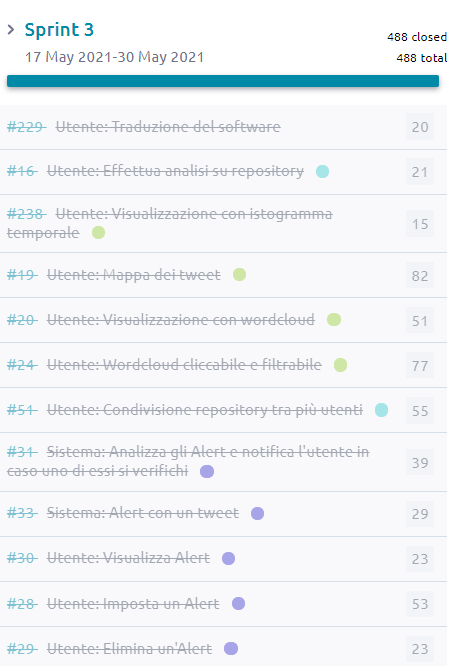

Sprint 3: 17 Mag - 30 Mag
=========================

Consegna
--------

La seguente documentazione è stata fornita dal cliente durante questo sprint:

- :download:`Sprint 3 <3-sprint-requirements.pdf>`
- :download:`Report finale <3-report.pdf>`

Goal
----

Il **goal** del terzo Sprint è stato far funzionare il crawler, gli alert e completare tutte i task rimanenti.

Tutto ciò è visibile dai task completati:

Grooming session
----------------

Sono state definite le nuove **User Stories** da inserire nel progetto sulla base delle nuove richieste pervenute dal cliente:

- analisi statistica più dettagliata
- postare su Twitter
- traduzione dell'interfaccia in inglese.

| La richiesta relativa alle *ricerche basate sulla geolocalizzazione*, come già comunicato al cliente, non è stata inserita per motivi tecnici legati alle features delle **API 1.1** che non permettono di eseguire query sui campi di posizione geografica.
| Le nuove User Stories sono state valutate tramite il metodo dello Scrum Poker, durante il quale ogni membro ha espresso la sua valutazione.
| Tutte le nuove richieste sono state accettate dal Product Owner e sono pronte ad essere inserite nello sprint di sviluppo in partenza.

Backlog
-------
.. image:: Backlog3.png
    :width: 400

**Burndown Chart**

.. image:: Chart3.png
    :width: 600

Definition of Ready
-------------------

Il team ha definito lo stato di Ready di una User Story in base ai seguenti criteri:

* La User Story è stata compresa ed accettata da tutti i membri
* I tester hanno confermato la possibilità di poterla testare
* Il Product Owner ha la visione necessaria per definirne la priorità
* Il Team è in grado di stimarla
* La User Story è indipendente o dipendente da altre a priorità maggiore

Definition of Done
------------------

La definizione di Done è stata concordata da tutto il team con il Product Owner, ed è stata così definita:

* Sviluppo completo della funzionalità richiesta
* Definizione e superamento dei test
* Bozza della documentazione della funzionalità
* Merge dei sorgenti nel branch ``main`` di GitLab

Registro attività
-----------------

.. todo::

    Compilare il registro attività dello sprint 3.

Riunioni collettive
^^^^^^^^^^^^^^^^^^^

.. list-table::
    :header-rows: 2

    * - Data
      - Durata
      - Attività
    * -
      - 3.5h
      - Totale

    * - 17/05
      - 2.0 h
      - Grooming session nuove richieste cliente

    * - 29/05
      - 1.5 h
      - sprint retrospective

    * -
      -
      -

Attività individuali
^^^^^^^^^^^^^^^^^^^^

Stefano Goldoni
"""""""""""""""

.. list-table::
    :header-rows: 2

    * - Data
      - Durata
      - Attività
    * -
      - 14h
      - Totale

    * - 21/05
      - 2.0h
      - Analisi strumenti di test frontend
    * - 24/05
      - 3.0h
      - Inizio test alerts
    * - 25/05
      - 2.5h
      - Test alerts
    * - 26/05
      - 3.0h
      - Test
    * - 28/05
      - 3.5h
      - Test, refactory in base a Sonarqube

Flavia Cocca
""""""""""""

.. list-table::
    :header-rows: 2

    * - Data
      - Durata
      - Attività
    * -
      - 14h
      - Totale

    * - 20/05
      - 2.0h
      - Trasferimento documenti in nuova documentazione

    * - 21/05
      - 1.0h
      - Studio Sphinx

    * - 23/05
      - 1.0h
      - Studio sintassi rST

    * - 24/05
      - 1.0h
      - Documentazione

    * - 25/05
      - 1.0h
      - Documentazione

    * - 26/05
      - 1.0h
      - Documentazione

    * - 27/05
      - 1.0h
      - Documentazione

    * - 28/05
      - 3.0h
      - Documentazione

    * - 29/05
      - 3.0h
      - Documentazione

Chiara Calzolari
""""""""""""""""

.. list-table::
    :header-rows: 2

    * - Data
      - Durata
      - Attività
    * -
      - 17h 30m
      - Totale

    * - 17/05
      - 3.0h
      - Traduzione UI
    * - 17/05
      - 1.5h
      - Traduzione UI
    * - 18/05
      - 1.5h
      - Traduzione UI
    * - 20/05
      - 1.0h
      - Traduzione UI
    * - 22/05
      - 1.0h
      - Traduzione UI
    * - 24/05
      - 2.0h
      - Traduzione UI
    * - 24/05
      - 1.0h
      - Traduzione UI
    * - 25/05
      - 1.0h
      - Traduzione UI
    * - 27/05
      - 0.5h
      - Traduzione UI
    * - 28/05
      - 2.0h
      - Configurazione ambiente di sviluppo
    * - 28/05
      - 3.0h
      - Creazione video-demo

Stefano Pigozzi
"""""""""""""""

.. list-table::
    :header-rows: 2

    * - Data
      - Durata
      - Attività
    * -
      -
      - Totale

    * -
      -
      -

Giovanni Anniballi
""""""""""""""""""

.. list-table::
    :header-rows: 2

    * - Data
      - Durata
      - Attività
    * -
      - 18h
      - Totale

    * - 17/05
      - 1h
      - Ricontrollo generale codice, fix piccoli typo

    * - 18/05
      - 1h
      - Aggiornati files di log e refactoring documentazione

    * - 21/05
      - 2h
      - Studio Jest, valutazione di test sul frontend

    * - 24/05
      - 3h
      - Primi test sulle autorizzazioni

    * - 26/05
      - 2h
      - Fix ai test

    * - 27/05
      - 2h
      - Test autorizzazioni completati, fix

    * - 28/05
      - 4h
      - Fix test malfunzionanti, refactoring test

    * - 29/05
      - 3h
      - Aggiornamento documentazione, aggiunti ulteriori test seguendo i suggerimenti di SQ

Giorgio Minoccari
"""""""""""""""""

.. list-table::
    :header-rows: 2

    * - Data
      - Durata
      - Attività
    * -
      -
      - Totale

    * -
      -
      -

Lorenzo Balugani
""""""""""""""""

.. list-table::
    :header-rows: 2

    * - Data
      - Durata
      - Attività
    * -
      - 22h
      - Totale

    * - 17/05
      - 4h
      - Bugfixing, supporto alla localizzazione degli errori
    * - 18/05
      - 3h
      - Bugfixing
    * - 20/05
      - 3h
      - API autorizzazioni, refactoring
    * - 21/05
      - 2h
      - Gestione tweet, rappresentazione tweet
    * - 24/05
      - 2h
      - Bugfixing
    * - 25/05
      - 4h
      - Docs, refactoring
    * - 27/05
      - 3h
      - Bugfixing
    * - 28/05
      - 6h
      - Bugfixing

Statistiche
-----------

Gitinspector
^^^^^^^^^^^^^

.. todo::

    Il prof. Marcello Missiroli non ha ancora generato la statistica dello Sprint 3.

Retrospettiva finale
--------------------

.. todo::

    Inserire qui la Retrospettiva finale.

Schermata finale di SonarQube
-----------------------------

- :download:`Schermata finale Sonarqube <sonarqube.pdf>`

Demo
----

- https://drive.google.com/file/d/15o70Ffe51CNj8LTKHC9dGiqRVnbv9UpZ/view?usp=sharing
