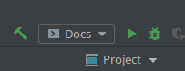

Meta-documentazione
===================

La documentazione è scritta in `reStructuredText <https://docutils.sourceforge.io/rst.html>`_, ed è generata con
`Sphinx <https://www.sphinx-doc.org/en/master/>`_.

I dati relativi alla documentazione si trovano nella directory standard ``/docs``;
in particolare, le sorgenti reStructuredText si trovano in ``/docs/source``,
mentre l'ultima versione compilata si trova in ``/docs/build``.

Questa struttura permetterebbe l'integrazione con lo strumento di "Continuous Documentation"
`ReadTheDocs <https://readthedocs.com/>`_, qualora il progetto fosse ospitato su GitHub o disponessimo di una licenza
almeno `Basic <https://readthedocs.com/pricing/>`_.

Compilazione con IntelliJ IDEA
------------------------------

È possibile compilare manualmente la documentazione con IntelliJ IDEA.

Su sistemi Linux, è disponibile la Run Configuration ``Docs``, che compilerà la versione HTML della documentazione se
eseguita.

Compilazione con GNU Make
-------------------------

È possibile compilare manualmente la documentazione con GNU Make.

Come prima cosa, è necessario :ref:`Installare le dipendenze Python` del progetto:

.. code-block:: console

    user:g2-progetto$ poetry install

Poi, si entri all'interno del virtual environment:

.. code-block:: console

    user:g2-progetto$ poetry shell

Una volta all'interno del venv, si entri nella cartella della documentazione:

.. code-block:: console

    user:g2-progetto$ cd docs

Infine, si esegua il target ``html`` del Makefile:

.. code-block:: console

    user:g2-progetto/docs$ make html

Compilazione con Windows Powershell
-----------------------------------

È possibile compilare manualmente la documentazione con Windows Powershell.

Come prima cosa, è necessario :ref:`Installare le dipendenze Python` del progetto:

.. code-block:: doscon

    g2-progetto> poetry install

Poi, si entri all'interno del virtual environment:

.. code-block:: doscon

    g2-progetto> poetry shell

Una volta all'interno del venv, si entri nella cartella della documentazione:

.. code-block:: doscon

    g2-progetto> cd docs

Infine, si esegua lo script ``make.bat`` con il parametro ``html``:

.. code-block:: doscon

    g2-progetto/docs> make html
